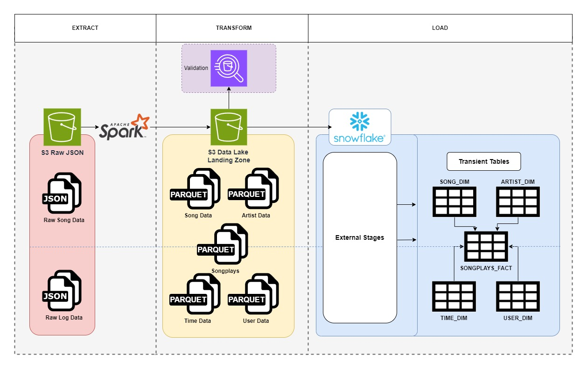

# Sparkify-ETL
ETL Pipeline for Sparkify Snowflake Database

## Snowflake Target Table DDL
```sql
-- SONGPLAYS FACT TABLE DDL
CREATE OR REPLACE TRANSIENT TABLE TECHCATALYST_DE.BCOMBS.SONGPLAYS_FACT (
    SONGPLAY_ID NUMBER,
    DATETIME_ID NUMBER,
    USER_ID STRING,
    LEVEL STRING,
    SONG_ID STRING,
    ARTIST_ID STRING,
    SESSION_ID NUMBER,
    LOCATION STRING,
    USER_AGENT STRING
);

-- SONGS DIMENSION TABLE DDL
CREATE OR REPLACE TRANSIENT TABLE TECHCATALYST_DE.BCOMBS.SONGS_DIM (
    SONG_ID STRING,
    TITLE VARCHAR(64),
    YEAR NUMBER(38,0),
    ARTIST_ID STRING,
    DURATION FLOAT
);

-- USERS DIMENSION TABLE DDL
CREATE OR REPLACE TRANSIENT TABLE TECHCATALYST_DE.BCOMBS.USER_DIM (
    USER_ID STRING,
    FIRST_NAME STRING,
    LAST_NAME STRING,
    GENDER STRING,
    LEVEL STRING
);

-- TIME DIMENSION TABLE DDL
CREATE OR REPLACE TRANSIENT TABLE TECHCATALYST_DE.BCOMBS.TIME_DIM (
    DATETIME_ID NUMBER,
    DATETIME STRING,
    START_TIME STRING,
    HOUR NUMBER,
    DAY NUMBER,
    WEEK NUMBER,
    MONTH NUMBER,
    YEAR NUMBER,
    WEEKDAY STRING    
);

-- ARTIST DIMENSION TABLE DDL
CREATE OR REPLACE TRANSIENT TABLE TECHCATALYST_DE.BCOMBS.ARTIST_DIM (
    ARTIST_ID STRING,
    NAME STRING,
    LOCATION STRING,
    LATTITUDE FLOAT,
    LONGITUDE FLOAT    
);
```

Update the initial Diagram “as needed/if needed” to better describe your overall solution architecture

## ETL Architecture Diagram


## Reasoning
The AWS S3 data lake serves as a cheap cloud storage option for raw and tranformed data.
Snowflakes Data Warehouse is optimal for storing cleaned data ready for analytics and reports.
The final dimension and fact table format of the data in Snowflake expidites the querying process and organization.
This ETL pipeline is the simple but optimal for Sparkify's end goal. The transformations are agnostic
to the storage options, should Sparkify decide to migrate to other cloud options, this pipeline generally holds true.


## Process
The raw data stored in S3 is transformed and enriched using apache pyspark, then lands in an S3 bucket. From there Snowflake pulls the
transformed data in S3 whre it can be stored in tables and be easily queried.

